# Ansible configuration management

> Update Name tag on your Jenkins EC2 Instance to Jenkins-Ansible. We will use this server to run playbooks.

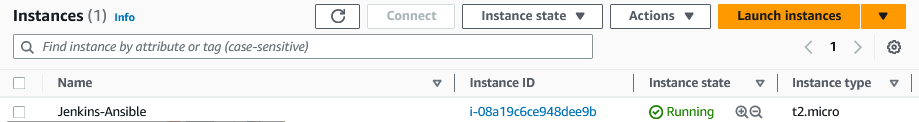

> In your GitHub account create a new repository and name it ansible-config-mgt

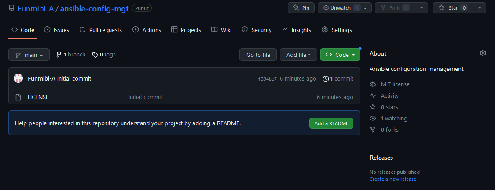

> Install Ansible

    sudo apt update
    sudo apt install ansible

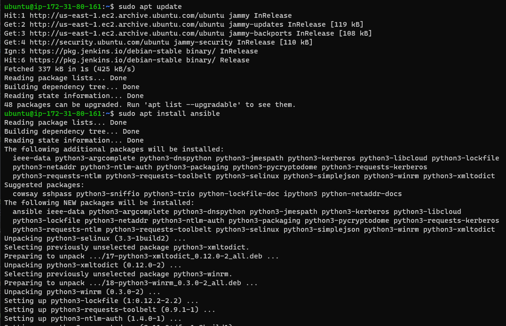

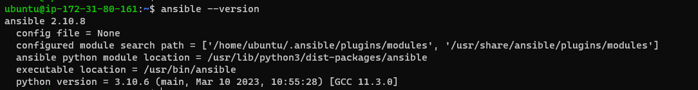

## Configure Jenkins build job to save your repository content every time you change it.

> Go to Jenkins web console, click "New Item" and create a "Freestyle project" called "ansible"

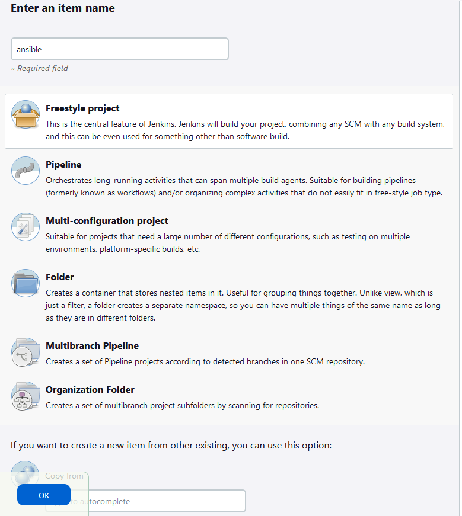

> Connect to your GitHub repository in Jenkins by provding the repostory URL

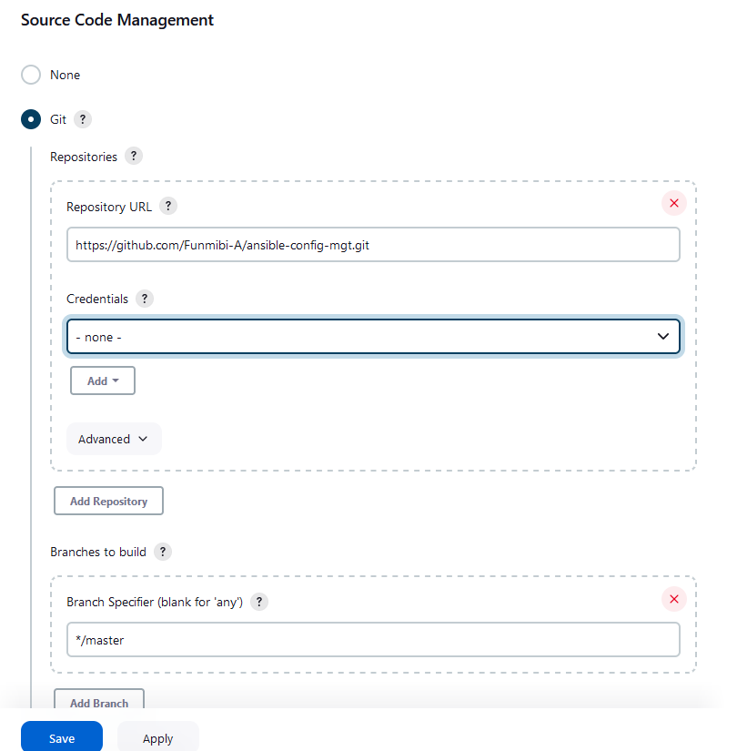

> Click "Configure" your job/project and add these two configurations

  - Configure triggering the job from GitHub webhook

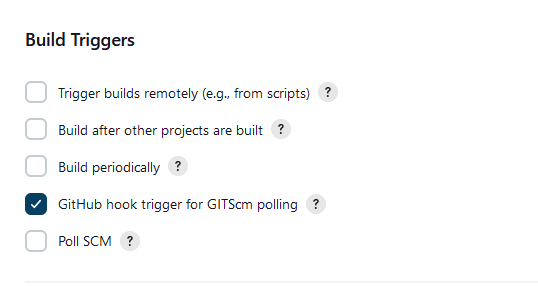

  - Post-build Actions

  Click on the drop down arrow and select "Send build artifacts over SSH" and then save.

> Configure Jenkins to copy files to NFS server via SSH

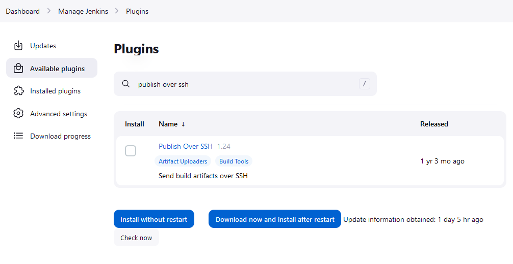

> Configure the job/project to copy artifacts over to NFS server.

- On main dashboard select "Manage Jenkins" under the "System Configuration menu" choose "System" menu item.

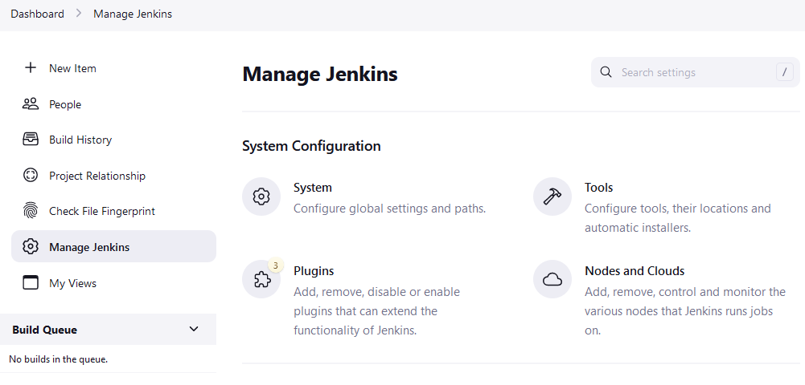

- Scroll down to "Publish over SSH" plugin configuration section and configure it to be able to connect to your NFS server and provide the following details:

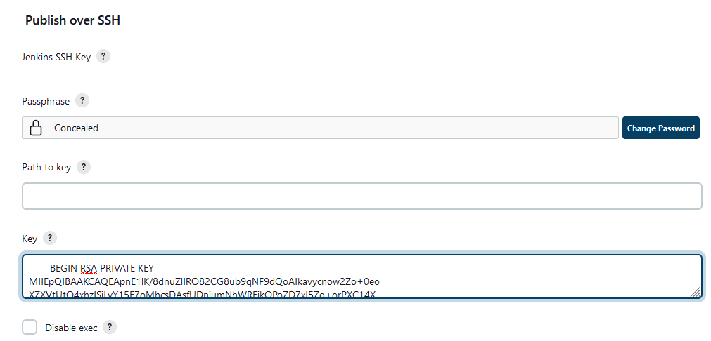

- Provide a private key (content of .pem file that you use to connect to NFS server via SSH/Putty)

- Arbitrary name
- Hostname – can be private IP address of your NFS server
- Username – ec2-user (since NFS server is based on EC2 with RHEL 8)
- Remote directory – /mnt/apps since our Web Servers use it as a mointing point to retrieve files from the NFS server
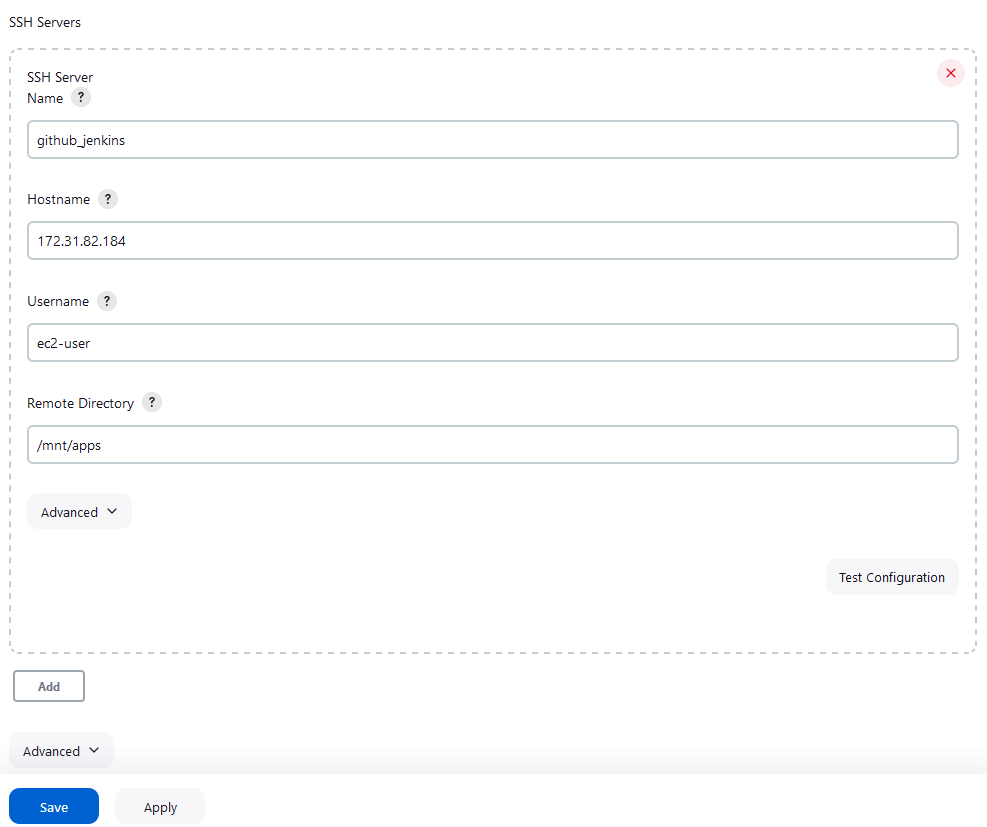

- Test the configuration and make sure the connection returns Success. Remember, that TCP port 22 on NFS server must be open to receive SSH connections.

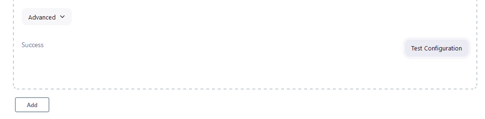

> Save the configuration, open your Jenkins job/project configuration page and add another one "Post-build Action"

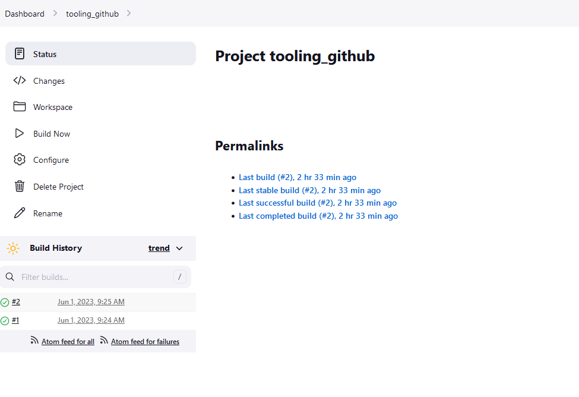

> Configure it to send all files probuced by the build into our previouslys define remote directory. In our case we want to copy all files and directories – so we use **.
If you want to apply some particular pattern to define which files to send – use this syntax.

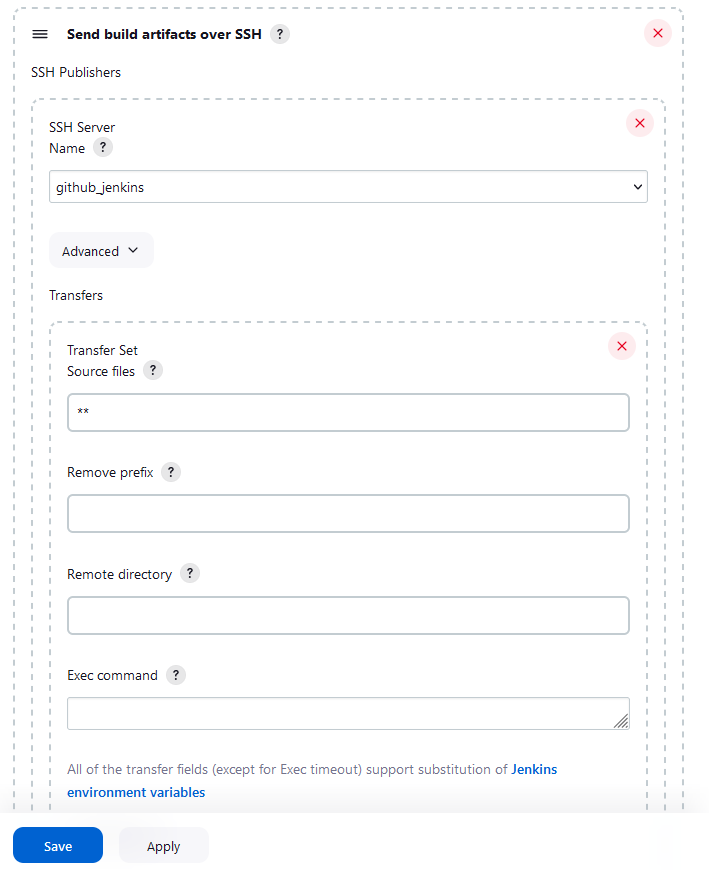

> Save this configuration and go ahead, change something in README.MD file in your GitHub Tooling repository.

- Webhook will trigger a new job and in the "Console Output" of the job you will find something like this:

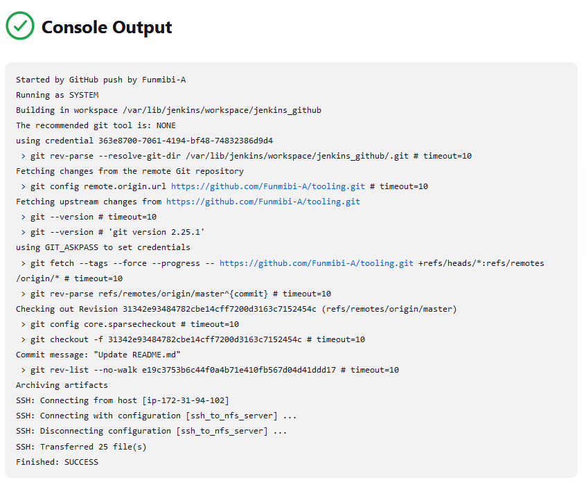

> To make sure that the files in /mnt/apps have been updated – connect via SSH/Putty to your NFS server and check README.MD file

    cat /mnt/apps/README.md

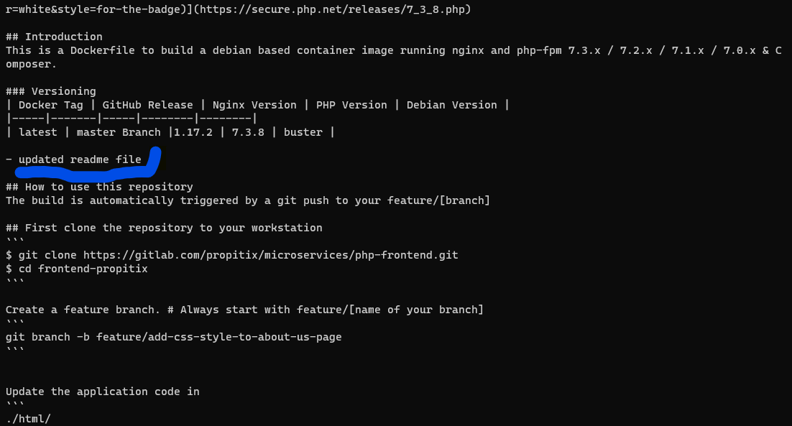


> In your ansible-config-mgt GitHub repository, create a new branch that will be used for development of a new feature. 

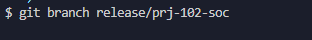

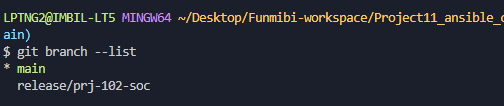

> Checkout the newly created feature branch to your local machine and start building your code and directory structure

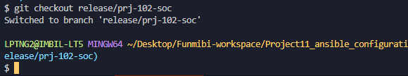

> Create a directory and name it playbooks – it will be used to store all your playbook files.

    mkdir playbooks

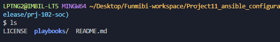

> Create a directory and name it inventory – it will be used to keep your hosts organised.

    mkdir inventory

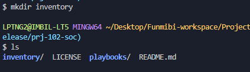

> Within the playbooks folder, create your first playbook, and name it common.yml

    cd playbooks
    touch common.yml

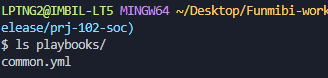

> Set up an Ansible Inventory 

- connect to the bastion server through ssh-agent
  note: setup ssh-agent on vs-code 

```
https://learn.microsoft.com/en-us/windows-server/administration/openssh/openssh_install_firstuse?tabs=gui

https://learn.microsoft.com/en-us/windows-server/administration/openssh/openssh_keymanagement
```
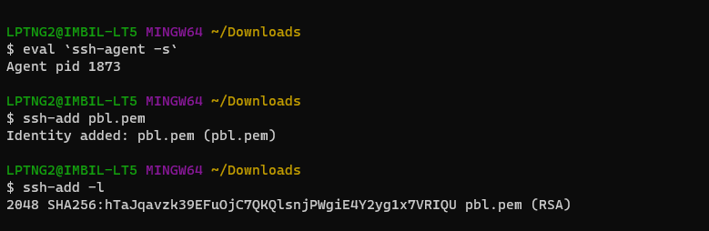

Note: your Load Balancer user is ubuntu and user for RHEL-based servers is ec2-user.

> Update your inventory/dev.yml file with this snippet of code:

    cd inventory
    sudo vi dev.yml
    ...and paste the code snippet in the file save 

```
[nfs]
<NFS-Server-Private-IP-Address> ansible_ssh_user='ec2-user'

[webservers]
<Web-Server1-Private-IP-Address> ansible_ssh_user='ec2-user'
<Web-Server2-Private-IP-Address> ansible_ssh_user='ec2-user'

[db]
<Database-Private-IP-Address> ansible_ssh_user='ec2-user' 

[lb]
<Load-Balancer-Private-IP-Address> ansible_ssh_user='ubuntu'
```

> Update your playbooks/common.yml file with this snippet of code:

```
    cd playbooks
    sudo vi common.yml
    ...and paste the code snippet in the file save 

---
- name: update web, nfs, and db servers
  hosts: webservers, nfs, db
  remote_user: ec2-user
  become: yes
  become_user: root
  tasks:
    - name: ensure wireshark is at the latest version
      yum:
        name: wireshark
        state: latest

    - name: create a directory and a file inside it
      file:
        path: /home/devOps
        state: directory
        mode: 0755

    - name: create a file inside the directory
      file:
        path: /home/devOps/playbook.yml
        state: touch
        mode: 0644

    - name: change timezone on all servers
      command: timedatectl set-timezone African/Lagos

    - name: run some shell script
      shell: /home/script.sh

- name: update LB server
  hosts: lb
  remote_user: ubuntu
  become: yes
  become_user: root
  tasks:
    - name: Update apt repo
      apt: 
        update_cache: yes

    - name: ensure wireshark is at the latest version
      apt:
        name: wireshark
        state: latest

    - name: create a directory and a file inside it
      file:
        path: /home/devOps
        state: directory
        mode: 0755

    - name: create a file inside the directory
      file:
        path: /home/devOps/playbook.yml
        state: touch
        mode: 0644

    - name: change timezone on all servers
      command: timedatectl set-timezone Africa/Lagos

    - name: run some shell script
      shell: /home/script.sh
```

> Update GIT with the latest code

- commit your code into GitHub

- use git commands to add, commit and push your branch to GitHub.


        git status
        git add .
        git commit -m 'Updated config files'

- Create a Pull request 

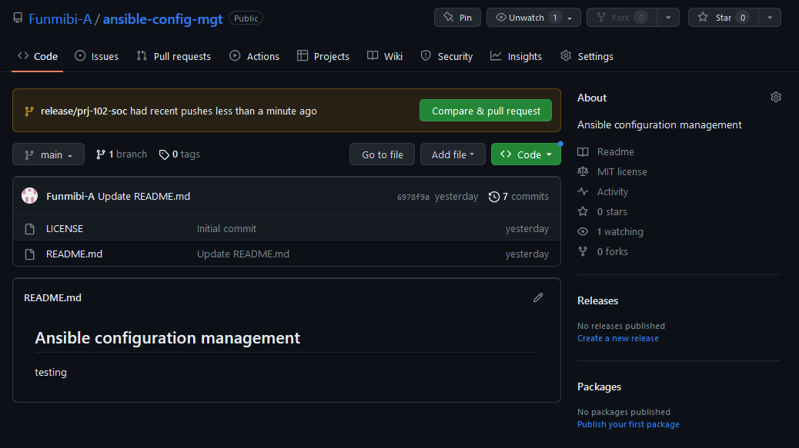


- Wear the hat of another developer for a second, and act as a reviewer.

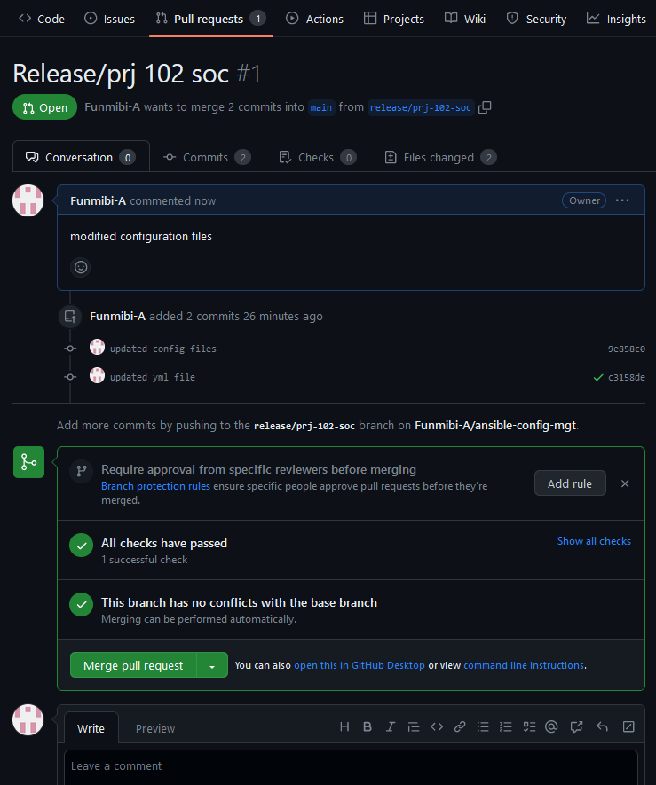

- If the reviewer is happy with your new feature development, merge the code to the master branch.

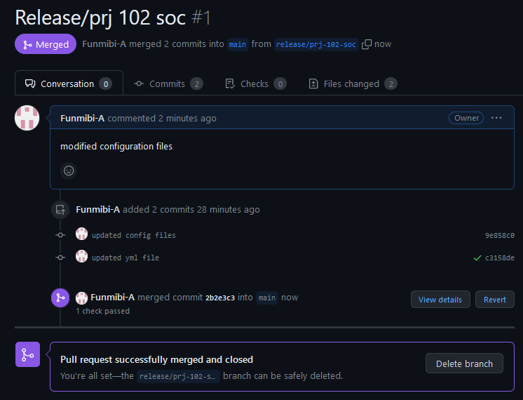

- Head back on your terminal, checkout from the feature branch into the master, and pull down the latest changes.

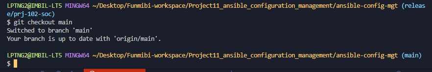
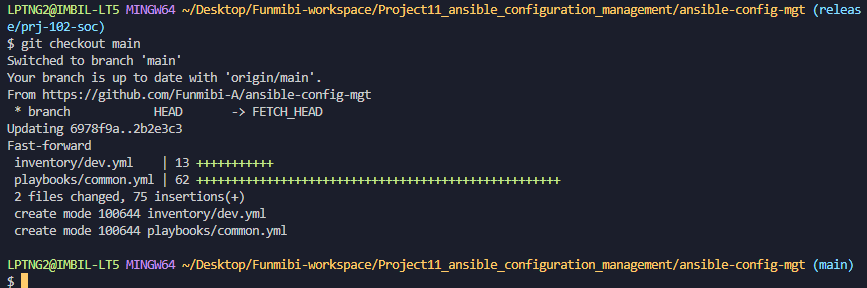

- Once your code changes appear in master branch – Jenkins will do its job and save all the files (build artifacts) to /var/lib/jenkins/jobs/ansible/builds/<build_number>/archive/ directory on Jenkins-Ansible server.